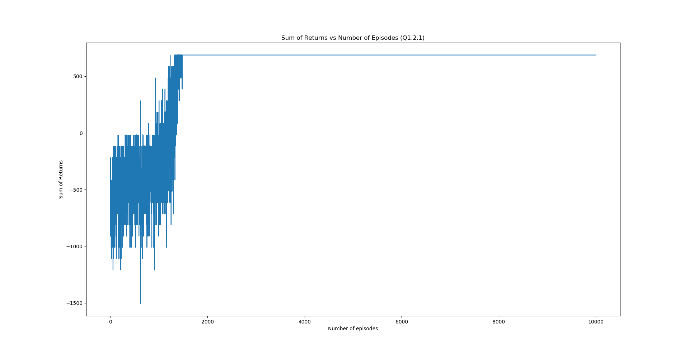
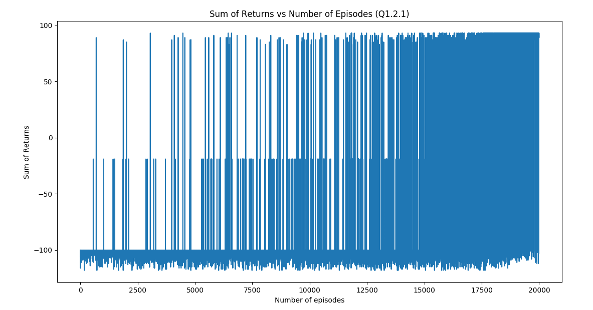

# Reinforcement-Learning----Monte-Carlo-Reinforce
Making use of Monte Carlo Algorithms with Baselines to solve MAP 2 of the Grid World Problem

MAP 2 is a simple 5x5 grid with holes and a goal posiiton. The objective is to learn a policy in order to allow the agent to reach the goal in the least number of steps.
The training for this algorithm can either be done using a stochastic or a determinsitic policy. Stochastic policy would choose actions uniformly based on the probabilties of the softmax. And Deterministic policy chooses actions with largest probability value. But regardless of the policy chosen, the agent will reach the goal optimally during test time.

The performance of the algorithm using the determinstic policy is as below: 
The performance of the algorithm using the stochastic policy is as below: 

In order to observe the simulation of the agent reaching the goal, load all the files in the same folder and make sure to run main.py only.

Note: The algorithm fails to reach the goal for larger maps such as MAP3 and MAP4 which have a larger and a more complex structure. But we can circumvent this caveat by using Q learning or other Temporal Difference (TD) based learning algorithms.
